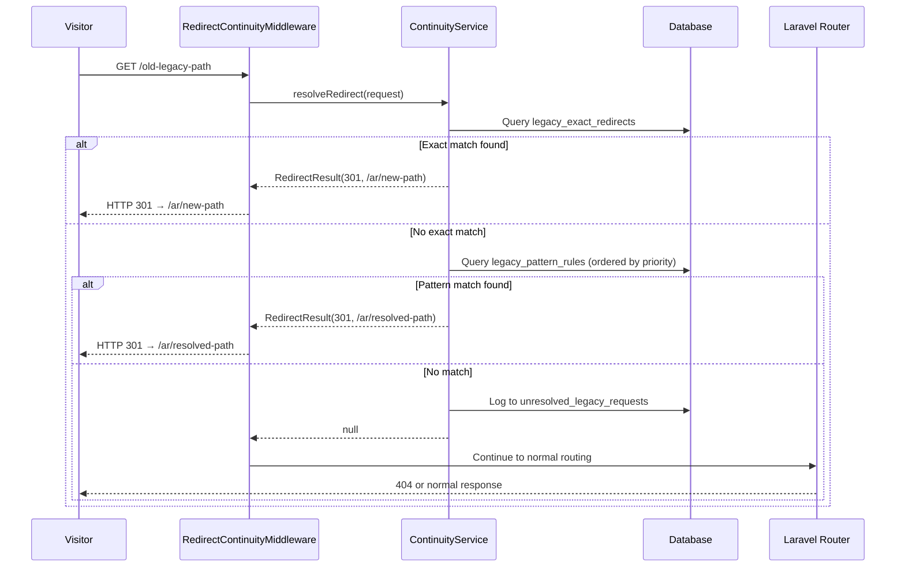
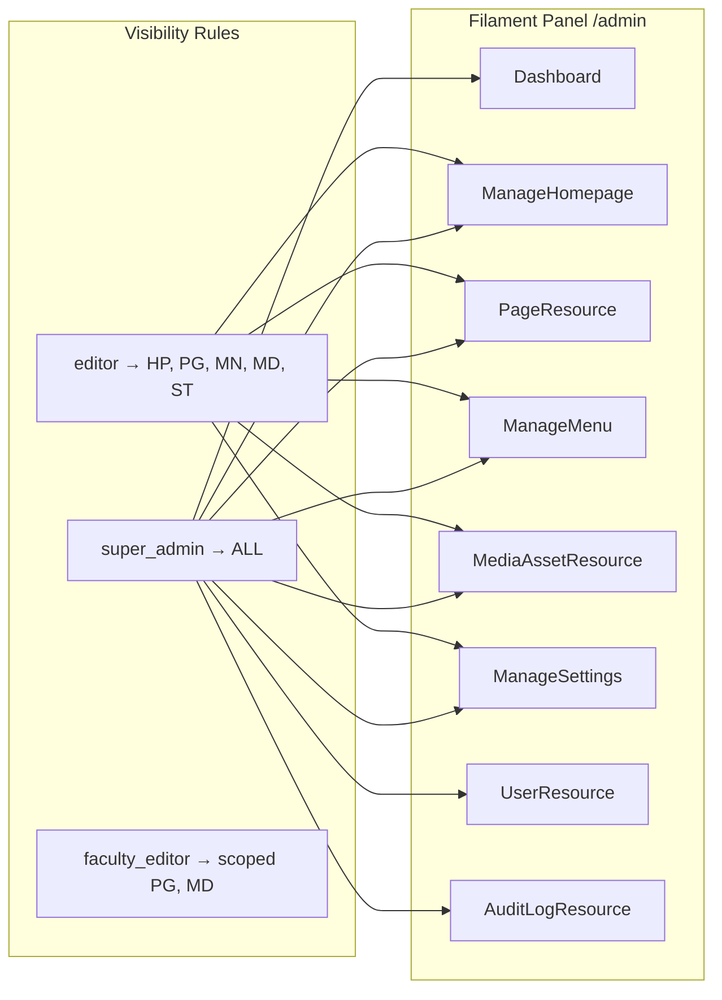

# Design Document — SPU Homepage Admin Foundation (PX05–PX08)

## Overview

This design covers the remaining implementation phases for the Syrian Private University website foundation: PX05 (SEO & Continuity), PX06 (Admin/Filament Completion), PX07 (Migration Backfill Tooling), and PX08 (Hardening/Tests/Launch). Requirements 1–14 (PX00–PX04) are already implemented and stable.

The existing codebase provides a complete service-layer architecture with 13 contracts, 46 DTOs, real services for all core domains, public homepage/page rendering, preview workflow, navigation aggregation, settings management, and menu management. Two placeholder services remain (MediaServicePlaceholder, SlugServicePlaceholder). Filament v3 is configured at `/admin` with auto-discovery but no resources/pages exist yet.

This design builds on top of the existing foundation without modifying stable PX00–PX04 code unless strictly necessary for integration.

### Phase Scope Summary

| Phase | Focus | New Components |
|-------|-------|----------------|
| PX05 | SEO completeness, sitemap, robots.txt, redirect continuity, file continuity | 4 new models, 2 new services, 1 new controller, 1 new middleware, 4 new migrations |
| PX06 | Filament admin panel resources and pages | 7 Filament resources/pages, 1 real MediaService, 1 real SlugService |
| PX07 | Migration backfill CLI tooling | 6 new Artisan commands |
| PX08 | Test coverage, launch validation, rollback prep | Feature/unit tests, 1 launch validation command, 1 cache warm command |

---

## Architecture

### System Context (PX05–PX08 Additions)

```mermaid
graph TB
    subgraph Public Runtime
        Crawler[Search Engine Crawler]
        Visitor[Public Visitor]
    end

    subgraph PX05 - SEO & Continuity
        SitemapCtrl[SitemapController]
        RobotsTxt[robots.txt route]
        ContMW[RedirectContinuityMiddleware]
        ContSvc[ContinuityService]
        SitemapSvc[SitemapService]
    end

    subgraph PX06 - Filament Admin
        HPRes[ManageHomepage Page]
        PageRes[PageResource]
        MenuRes[ManageMenu Page]
        MediaRes[MediaAssetResource]
        SettRes[ManageSettings Page]
        UserRes[UserResource]
        AuditRes[AuditLogResource]
    end

    subgraph Existing Services
        PageSvc[PageService]
        HomeSvc[HomepageSectionService]
        HPubSvc[HomepagePublishingService]
        MenuSvc[MenuService]
        MediaSvc[MediaService]
        SettSvc[SettingsService]
        AuditSvc[AuditService]
        AuthSvc[AuthService]
        CacheSvc[CacheService]
        SeoSvc[SeoMetadataService]
        NavSvc[NavigationService]
        PreviewSvc[PreviewService]
    end

    subgraph PX07 - CLI Tooling
        URLCmd[continuity:export-url-inventory]
        RedirCmd[continuity:validate-redirects]
        FileCmd[continuity:export-file-inventory]
        UnresCmd[continuity:report-unresolved]
        SeoCmd[continuity:validate-seo]
        ReconCmd[continuity:reconciliation-report]
    end

    Crawler --> SitemapCtrl
    Crawler --> RobotsTxt
    Visitor --> ContMW
    ContMW --> ContSvc

    HPRes --> HomeSvc
    HPRes --> HPubSvc
    HPRes --> PreviewSvc
    PageRes --> PageSvc
    MenuRes --> MenuSvc
    MediaRes --> MediaSvc
    SettRes --> SettSvc
    UserRes --> AuthSvc
    AuditRes --> AuditSvc

    SitemapCtrl --> SitemapSvc
    SitemapSvc --> PageSvc
    ContSvc --> CacheSvc

    URLCmd --> ContSvc
    RedirCmd --> ContSvc
    SeoCmd --> SeoSvc
```



### Request Flow — Redirect Continuity



### Filament Admin Panel Structure



---

## Components and Interfaces

### PX05 — SEO & Continuity

#### New Contract: `ContinuityServiceInterface`

```
File: app/Contracts/ContinuityServiceInterface.php
```

```php
interface ContinuityServiceInterface
{
    /** Resolve a redirect for the given request path. Returns null if no match. */
    public function resolveRedirect(string $path, ?string $queryString = null): ?RedirectResultDTO;

    /** Resolve a legacy file path to a current delivery URL. Returns null if no match. */
    public function resolveFileContinuity(string $path): ?string;

    /** Log an unresolved legacy request. */
    public function logUnresolved(UnresolvedRequestDTO $request): bool;

    /** Get all exact redirect rules. */
    public function getExactRedirects(): Collection;

    /** Get all pattern redirect rules ordered by priority. */
    public function getPatternRules(): Collection;

    /** Validate redirect rules for conflicts, duplicates, loops. */
    public function validateRedirectRules(): ValidationResultDTO;

    /** Get unresolved requests with optional filters. */
    public function getUnresolvedRequests(array $filters = []): Collection;

    /** Get file continuity inventory. */
    public function getFileInventory(): Collection;
}
```

#### New Contract: `SitemapServiceInterface`

```
File: app/Contracts/SitemapServiceInterface.php
```

```php
interface SitemapServiceInterface
{
    /** Generate sitemap entries for all published, publicly visible pages. */
    public function generateEntries(): Collection;

    /** Render the sitemap as XML string. */
    public function renderXml(): string;
}
```

#### New DTOs

| DTO | File | Fields |
|-----|------|--------|
| `RedirectResultDTO` | `app/DTOs/RedirectResultDTO.php` | `int $statusCode`, `string $destinationUrl`, `string $matchType` (exact\|pattern) |
| `UnresolvedRequestDTO` | `app/DTOs/UnresolvedRequestDTO.php` | `string $url`, `?string $queryString`, `string $method`, `?string $referrer`, `?string $resolvedLocale`, `string $requestType` (page\|file), `string $timestamp` |
| `SitemapEntryDTO` | `app/DTOs/SitemapEntryDTO.php` | `string $loc`, `string $lastmod`, `?string $changefreq`, `?string $priority`, `array $alternates` |
| `RedirectRuleDTO` | `app/DTOs/RedirectRuleDTO.php` | `int $id`, `string $legacyPath`, `string $destinationUrl`, `int $statusCode`, `?string $locale`, `bool $isActive` |
| `PatternRuleDTO` | `app/DTOs/PatternRuleDTO.php` | `int $id`, `string $pattern`, `string $replacement`, `int $statusCode`, `int $priority`, `bool $isActive` |
| `FileInventoryItemDTO` | `app/DTOs/FileInventoryItemDTO.php` | `int $id`, `string $legacyPath`, `?string $currentPath`, `?int $mediaAssetId`, `string $status` (mapped\|unmapped\|missing) |

#### New Service: `ContinuityService`

```
File: app/Services/ContinuityService.php
Implements: ContinuityServiceInterface
```

Responsibilities:
- Query `legacy_exact_redirects` for exact path matches (case-insensitive)
- Query `legacy_pattern_rules` ordered by priority for regex/pattern matches
- Detect and prevent redirect loops (max 5 hops)
- Log unresolved requests to `unresolved_legacy_requests`
- Query `legacy_file_inventory` for file continuity resolution
- Validate redirect rules for conflicts/duplicates

#### New Service: `SitemapService`

```
File: app/Services/SitemapService.php
Implements: SitemapServiceInterface
```

Responsibilities:
- Query published, enabled pages with `status = 'published'` and `is_enabled = true`
- Exclude homepage shell pages (use canonical `/{locale}` instead)
- Include both AR and EN URLs with hreflang alternates
- Exclude admin, preview, and draft URLs
- Cache sitemap output with tag-based invalidation

#### New Controller: `SitemapController`

```
File: app/Http/Controllers/SitemapController.php
```

```php
final class SitemapController extends Controller
{
    public function __construct(
        private readonly SitemapServiceInterface $sitemapService,
    ) {}

    public function sitemap(): Response { /* XML response */ }
    public function robots(Request $request): Response { /* text/plain response */ }
}
```

#### New Middleware: `RedirectContinuityMiddleware`

```
File: app/Http/Middleware/RedirectContinuityMiddleware.php
```

- Registered globally in `bootstrap/app.php` (early in the pipeline, before locale middleware)
- Skips `/admin`, `/livewire`, `/filament` prefixes
- Calls `ContinuityService::resolveRedirect()` for non-matching routes
- Returns redirect response or passes through to next middleware
- Logs unresolved requests on 404 responses (via `terminate()` method)

#### New Routes

```php
// In routes/web.php
Route::get('/sitemap.xml', [SitemapController::class, 'sitemap'])->name('sitemap');
Route::get('/robots.txt', [SitemapController::class, 'robots'])->name('robots');
```

### PX06 — Filament Admin Completion

#### Filament Resources and Pages

All Filament components live under `app/Filament/Resources/` and `app/Filament/Pages/`.

| Component | Type | File Path | Delegates To |
|-----------|------|-----------|-------------|
| `ManageHomepage` | Filament Page | `app/Filament/Pages/ManageHomepage.php` | `HomepageSectionServiceInterface`, `HomepagePublishingServiceInterface`, `PreviewServiceInterface` |
| `PageResource` | Filament Resource | `app/Filament/Resources/PageResource.php` | `PageServiceInterface` |
| `ManageMenu` | Filament Page | `app/Filament/Pages/ManageMenu.php` | `MenuServiceInterface` |
| `MediaAssetResource` | Filament Resource | `app/Filament/Resources/MediaAssetResource.php` | `MediaServiceInterface` |
| `ManageSettings` | Filament Page | `app/Filament/Pages/ManageSettings.php` | `SettingsServiceInterface` |
| `UserResource` | Filament Resource | `app/Filament/Resources/UserResource.php` | `AuthServiceInterface` |
| `AuditLogResource` | Filament Resource | `app/Filament/Resources/AuditLogResource.php` | `AuditServiceInterface` |

#### ManageHomepage Page

- Custom Filament page (not a resource — homepage is a singleton, not a CRUD entity)
- Renders the fixed 10-section model with tabbed or accordion layout per section
- Each section has AR/EN locale tabs with structured form fields matching the section payload schema
- Actions: Save Draft, Preview (AR), Preview (EN), Publish, Schedule, Unpublish
- Displays current state badge (draft/published/scheduled)
- All operations delegate to `HomepageSectionServiceInterface` and `HomepagePublishingServiceInterface`
- `canAccess()`: returns `true` for `super_admin` and `editor` roles

#### PageResource

- Standard Filament resource with list, create, edit, view pages
- List: filterable by status, locale, parent; sortable by title, updated_at
- Create/Edit form tabs:
  - Metadata: parent, slug, template, status, enabled/nav/breadcrumb toggles
  - Arabic Translation: title, headline, subheadline, hero, body, CTA, sidebar, excerpt
  - English Translation: same fields
  - Arabic SEO: meta_title, meta_description, og_title, og_description, og_image, canonical, robots
  - English SEO: same fields
- Actions: Save Draft, Preview, Publish, Schedule, Unpublish
- All operations delegate to `PageServiceInterface`
- `canAccess()`: `super_admin`, `editor`, `faculty_editor` (scoped)

#### ManageMenu Page

- Custom Filament page with tree builder UI
- Supports header, footer, utility menu groups via tabs
- Each item: label (AR/EN), target type (page/custom URL/external), URL, enabled toggle, open_in_new_tab
- Drag/drop reordering with depth enforcement (max 2)
- Delegates to `MenuServiceInterface`
- `canAccess()`: `super_admin`, `editor`

#### MediaAssetResource

- Standard Filament resource
- List: grid/table view toggle, search by filename/title, filter by mime_type
- Upload: file upload field delegating to `MediaServiceInterface::upload()`
- Edit: title (AR/EN), alt_text (AR/EN), caption (AR/EN)
- View: preview image/file, metadata display (URL, type, dimensions, size)
- `canAccess()`: `super_admin`, `editor`, `faculty_editor`

#### ManageSettings Page

- Custom Filament page with grouped form sections
- Groups: Utility Navigation, Footer, Emergency Notice, Contact, Social, SEO Defaults
- Locale-aware fields where applicable (AR/EN tabs within groups)
- Delegates to `SettingsServiceInterface`
- `canAccess()`: `super_admin`, `editor`

#### UserResource

- Standard Filament resource (super_admin only)
- List: name, email, role, locked status, last login
- Edit: name, email, role assignment, faculty_scope_slug, lock/unlock toggle, password reset
- No delete action (soft-delete only via lock)
- Delegates to `AuthServiceInterface`
- `canAccess()`: `super_admin` only

#### AuditLogResource

- Read-only Filament resource
- List: filterable by action, entity_type, user, date range
- View: full metadata JSON display
- No create/edit/delete actions
- `canAccess()`: `super_admin` only

#### Real MediaService (replacing placeholder)

```
File: app/Services/MediaService.php
Implements: MediaServiceInterface
```

Responsibilities:
- Handle file upload to configured disk (local/s3)
- Validate file type, size, dimensions
- Store metadata in `media_assets` table
- Return `MediaUploadResultDTO`
- Support listing with filters, metadata updates, soft-delete

#### Real SlugService (replacing placeholder)

```
File: app/Services/SlugService.php
Implements: SlugServiceInterface
```

Responsibilities:
- Generate URL-safe slugs from Arabic/English source text
- Ensure uniqueness within the target model's table
- Support transliteration for Arabic text

### PX07 — Migration Backfill Tooling

All commands registered in `routes/console.php`.

| Command | Signature | Output |
|---------|-----------|--------|
| `continuity:export-url-inventory` | `{--format=json} {--disk=local}` | JSON/CSV of legacy URL candidates |
| `continuity:validate-redirects` | `{--fix}` | Report of invalid/duplicate/conflicting rules |
| `continuity:export-file-inventory` | `{--format=json} {--disk=local}` | JSON/CSV of file continuity state |
| `continuity:report-unresolved` | `{--since=} {--type=} {--format=json}` | Structured report of unresolved requests |
| `continuity:validate-seo` | `{--locale=} {--format=json}` | Report of pages with weak/missing SEO |
| `continuity:reconciliation-report` | `{--format=json} {--disk=local}` | Combined reconciliation report |

All commands:
- Produce machine-readable output (JSON or CSV)
- Reuse existing `MigrationLog`, `MigrationRejection`, `LegacyRecordSnapshot` infrastructure
- Use `ContinuityServiceInterface` and `SeoMetadataServiceInterface` for data access
- Support `--disk` and `--dir` options for export file placement

### PX08 — Hardening/Tests/Launch

#### Launch Validation Command

```
Signature: launch:validate {--environment=staging}
```

Checks: homepage AR/EN rendering, landing page rendering, canonical/hreflang correctness, sitemap presence, robots.txt correctness, redirect continuity samples, file continuity samples, admin preview safety, cache behavior, audit behavior.

#### Cache Warm Command

```
Signature: cache:warm {--locale=} {--include-sitemap}
```

Warms: homepage AR/EN, top-level landing pages AR/EN, navigation/settings payloads, sitemap output.

---

## Data Models

### New Database Tables (PX05)

#### `legacy_exact_redirects`

```sql
CREATE TABLE legacy_exact_redirects (
    id BIGINT UNSIGNED AUTO_INCREMENT PRIMARY KEY,
    legacy_path VARCHAR(2048) NOT NULL,
    destination_url VARCHAR(2048) NOT NULL,
    status_code SMALLINT UNSIGNED NOT NULL DEFAULT 301,
    locale VARCHAR(5) NULL,
    is_active BOOLEAN NOT NULL DEFAULT TRUE,
    hit_count INT UNSIGNED NOT NULL DEFAULT 0,
    last_hit_at TIMESTAMP NULL,
    notes TEXT NULL,
    created_at TIMESTAMP NULL,
    updated_at TIMESTAMP NULL,
    INDEX idx_legacy_path (legacy_path(191)),
    INDEX idx_is_active (is_active)
);
```

#### `legacy_pattern_rules`

```sql
CREATE TABLE legacy_pattern_rules (
    id BIGINT UNSIGNED AUTO_INCREMENT PRIMARY KEY,
    pattern VARCHAR(2048) NOT NULL COMMENT 'Regex or glob pattern for matching legacy paths',
    replacement VARCHAR(2048) NOT NULL COMMENT 'Destination template with capture group references',
    status_code SMALLINT UNSIGNED NOT NULL DEFAULT 301,
    priority INT UNSIGNED NOT NULL DEFAULT 100 COMMENT 'Lower = higher priority',
    is_active BOOLEAN NOT NULL DEFAULT TRUE,
    hit_count INT UNSIGNED NOT NULL DEFAULT 0,
    last_hit_at TIMESTAMP NULL,
    notes TEXT NULL,
    created_at TIMESTAMP NULL,
    updated_at TIMESTAMP NULL,
    INDEX idx_priority (priority),
    INDEX idx_is_active (is_active)
);
```

#### `unresolved_legacy_requests`

```sql
CREATE TABLE unresolved_legacy_requests (
    id BIGINT UNSIGNED AUTO_INCREMENT PRIMARY KEY,
    url VARCHAR(2048) NOT NULL,
    query_string VARCHAR(2048) NULL,
    method VARCHAR(10) NOT NULL DEFAULT 'GET',
    referrer VARCHAR(2048) NULL,
    resolved_locale VARCHAR(5) NULL,
    request_type ENUM('page', 'file') NOT NULL DEFAULT 'page',
    user_agent VARCHAR(512) NULL,
    ip_hash VARCHAR(64) NULL COMMENT 'Hashed IP for dedup, not raw IP',
    hit_count INT UNSIGNED NOT NULL DEFAULT 1,
    first_seen_at TIMESTAMP NOT NULL,
    last_seen_at TIMESTAMP NOT NULL,
    created_at TIMESTAMP NULL,
    INDEX idx_url (url(191)),
    INDEX idx_request_type (request_type),
    INDEX idx_last_seen (last_seen_at)
);
```

#### `legacy_file_inventory`

```sql
CREATE TABLE legacy_file_inventory (
    id BIGINT UNSIGNED AUTO_INCREMENT PRIMARY KEY,
    legacy_path VARCHAR(2048) NOT NULL,
    current_path VARCHAR(2048) NULL,
    media_asset_id BIGINT UNSIGNED NULL,
    status ENUM('mapped', 'unmapped', 'missing') NOT NULL DEFAULT 'unmapped',
    mime_type VARCHAR(255) NULL,
    file_size_bytes BIGINT UNSIGNED NULL,
    notes TEXT NULL,
    created_at TIMESTAMP NULL,
    updated_at TIMESTAMP NULL,
    FOREIGN KEY (media_asset_id) REFERENCES media_assets(id) ON DELETE SET NULL,
    INDEX idx_legacy_path (legacy_path(191)),
    INDEX idx_status (status)
);
```

### New Eloquent Models (PX05)

| Model | File | Table |
|-------|------|-------|
| `LegacyExactRedirect` | `app/Models/LegacyExactRedirect.php` | `legacy_exact_redirects` |
| `LegacyPatternRule` | `app/Models/LegacyPatternRule.php` | `legacy_pattern_rules` |
| `UnresolvedLegacyRequest` | `app/Models/UnresolvedLegacyRequest.php` | `unresolved_legacy_requests` |
| `LegacyFileInventory` | `app/Models/LegacyFileInventory.php` | `legacy_file_inventory` |

All models follow existing conventions: `HasFactory`, typed `$fillable`, explicit `casts()`, passive (no business logic).

### Existing Tables Used (No Changes)

- `pages`, `page_translations`, `page_seo_meta` — used by SitemapService, SEO validation
- `homepage_sections`, `homepage_section_translations`, `homepage_drafts` — used by ManageHomepage
- `menu_items` — used by ManageMenu
- `media_assets` — used by MediaAssetResource, file continuity
- `settings` — used by ManageSettings
- `users`, `roles` — used by UserResource
- `audit_logs` — used by AuditLogResource
- `migration_logs`, `migration_rejections`, `legacy_record_snapshots` — used by PX07 commands

---

## Correctness Properties

*A property is a characteristic or behavior that should hold true across all valid executions of a system — essentially, a formal statement about what the system should do. Properties serve as the bridge between human-readable specifications and machine-verifiable correctness guarantees.*

### Property 1: Canonical URL is always absolute and locale-correct

*For any* page (homepage shell or landing page) and any locale (ar or en), the canonical URL generated by `SeoMetadataService::buildForPage()` SHALL be an absolute URL (starting with `http://` or `https://`) and SHALL contain the correct locale prefix in the path.

**Validates: Requirements 15.1, 15.2**

### Property 2: Hreflang reciprocity

*For any* locale-path map with N entries, `SeoMetadataService::resolveHreflang()` SHALL return exactly N hreflang entries, each with a valid absolute URL, and the set of locales in the output SHALL exactly match the set of locales in the input map.

**Validates: Requirements 15.3**

### Property 3: SEO field resolution with fallback

*For any* page with SEO metadata, `SeoMetadataService::buildForPage()` SHALL use the page-specific value for each SEO field when present, and SHALL fall back to the settings-backed default for each field that is null or missing. The output DTO SHALL never have a null `title` field.

**Validates: Requirements 15.4, 15.5**

### Property 4: Sitemap contains only published, enabled pages

*For any* collection of pages with mixed statuses (draft, published, scheduled, disabled), `SitemapService::generateEntries()` SHALL return entries only for pages where `status = 'published'` AND `is_enabled = true` AND `published_at` is not null. No draft, unpublished, scheduled-not-yet-public, or disabled page SHALL appear in the output.

**Validates: Requirements 16.1, 16.2**

### Property 5: Exact redirect resolution correctness

*For any* active exact redirect rule with legacy path P, destination D, and status code S, calling `ContinuityService::resolveRedirect(P)` SHALL return a `RedirectResultDTO` with `destinationUrl = D`, `statusCode = S`, and `matchType = 'exact'`.

**Validates: Requirements 17.1**

### Property 6: Pattern redirect resolution correctness

*For any* active pattern redirect rule with pattern R, replacement template T, and a request path P that matches R, calling `ContinuityService::resolveRedirect(P)` SHALL return a `RedirectResultDTO` with the destination resolved by applying capture groups from P against T, and `matchType = 'pattern'`.

**Validates: Requirements 17.2**

### Property 7: Unresolved request logging completeness

*For any* request path that does not match any exact or pattern redirect rule, `ContinuityService::logUnresolved()` SHALL persist a record containing all required fields (url, method, request_type), and the `request_type` field SHALL be `'file'` if the path contains a file extension (e.g., `.pdf`, `.doc`, `.jpg`) and `'page'` otherwise.

**Validates: Requirements 17.3**

### Property 8: No redirect loops

*For any* set of redirect rules (exact and pattern combined), following the redirect chain from any starting path SHALL terminate within 5 hops. If a cycle is detected, `ContinuityService::resolveRedirect()` SHALL return the last non-looping destination rather than entering an infinite loop.

**Validates: Requirements 17.4**

### Property 9: Exact rules take priority over pattern rules

*For any* request path that matches both an active exact redirect rule and an active pattern redirect rule, `ContinuityService::resolveRedirect()` SHALL return the exact rule's destination, never the pattern rule's destination.

**Validates: Requirements 17.5**

### Property 10: File continuity resolution correctness

*For any* active file inventory entry with legacy path P, status `'mapped'`, and current path C, calling `ContinuityService::resolveFileContinuity(P)` SHALL return C. For any path that does not match any file inventory entry, the method SHALL return null.

**Validates: Requirements 18.1**

### Property 11: Redirect rule conflict detection

*For any* set of redirect rules containing duplicate legacy paths (two exact rules with the same path) or conflicting patterns (two pattern rules that match the same input with different destinations), `ContinuityService::validateRedirectRules()` SHALL identify and report all duplicates and conflicts in the returned `ValidationResultDTO`.

**Validates: Requirements 27.2**

### Property 12: SEO completeness validation identifies weak entries

*For any* published page where the meta_title is null/empty OR the meta_description is null/empty OR canonical_url is null/empty, the SEO validation command SHALL include that page in its report of pages with weak or missing SEO metadata.

**Validates: Requirements 27.5**

---

## Error Handling

### PX05 — SEO & Continuity

| Scenario | Handling |
|----------|----------|
| Sitemap generation fails (DB error) | Return HTTP 500 with empty XML body; log error. Do not cache failed output. |
| Redirect rule regex is invalid | `ContinuityService` catches `preg_match` errors, skips the rule, logs warning. Never crash the request pipeline. |
| Redirect loop detected | Return the last valid destination before the loop. Log the loop chain for admin review. |
| Unresolved request logging fails | Silently fail (fire-and-forget in `terminate()`). Never block the user's 404 response. |
| File inventory entry points to missing media asset | Return null from `resolveFileContinuity()`. Log as `status = 'missing'` in inventory. |
| robots.txt environment detection fails | Default to restrictive (`Disallow: /`) to prevent accidental indexing of non-production. |

### PX06 — Filament Admin

| Scenario | Handling |
|----------|----------|
| Homepage publish validation fails | Return structured `ValidationResultDTO` with per-section errors. Filament displays as notification + inline errors. |
| Media upload exceeds size limit | `MediaService` throws validation exception. Filament catches and displays file size error. |
| Media upload invalid MIME type | `MediaService` throws validation exception. Filament displays allowed types. |
| Page slug conflict | `SlugService` appends numeric suffix. If still conflicting after 10 attempts, throw exception. |
| Menu depth violation | `MenuService` returns validation error. Filament displays depth limit message. |
| Unauthorized access attempt | Filament `canAccess()` returns false → 403. Gate/Policy denials → 403. |
| Settings update with invalid JSON | `SettingsService` validates structure. Returns `ValidationResultDTO` with field-level errors. |
| User lock/unlock of own account | `AuthService` prevents self-lock for super_admin. Returns error. |

### PX07 — CLI Tooling

| Scenario | Handling |
|----------|----------|
| Legacy database connection unavailable | Command outputs warning, continues with available data, notes unavailable sources in report. |
| Export disk not writable | Command fails with clear error message and exit code 1. |
| No data found for report | Command outputs empty report structure with zero counts. Exit code 0. |
| Invalid redirect rule detected during validation | Included in validation report with reason. `--fix` flag removes/deactivates invalid rules. |

### PX08 — Launch Validation

| Scenario | Handling |
|----------|----------|
| Validation check fails | Command continues all checks, reports all failures at end. Exit code 1 if any critical check fails. |
| Cache warm target unavailable | Log warning, continue to next target. Report partial warm at end. |

---

## Testing Strategy

### Testing Framework

- PHPUnit for all tests (Laravel's default)
- Pest PHP as optional wrapper for more expressive syntax
- **PHPUnit data providers** for property-based-style testing with generated inputs
- **Pest Datasets** if using Pest, for parameterized property tests

### Property-Based Testing Approach

This project uses **PHPUnit with custom data providers** to achieve property-based testing semantics. Each property test uses a data provider that generates 100+ random inputs to verify universal properties.

Library: PHPUnit (built-in) with custom `PropertyTestHelpers` trait providing:
- `randomLocale()`: returns 'ar' or 'en'
- `randomSlugPath()`: generates random valid slug paths (1-3 segments)
- `randomSeoFields()`: generates random SEO field combinations with nullable fields
- `randomRedirectRules()`: generates random exact/pattern redirect rule sets
- `randomPageCollection()`: generates random page collections with mixed statuses

Each property test MUST:
- Run minimum 100 iterations via data provider
- Reference its design document property in a comment tag
- Tag format: `Feature: spu-homepage-admin-foundation, Property {number}: {property_text}`

### Test Organization

```
tests/
├── Feature/
│   ├── PX05/
│   │   ├── SitemapTest.php
│   │   ├── RobotsTxtTest.php
│   │   ├── RedirectContinuityTest.php
│   │   ├── FileContinuityTest.php
│   │   └── SeoRenderingTest.php
│   ├── PX06/
│   │   ├── ManageHomepageTest.php
│   │   ├── PageResourceTest.php
│   │   ├── ManageMenuTest.php
│   │   ├── MediaAssetResourceTest.php
│   │   ├── ManageSettingsTest.php
│   │   ├── UserResourceTest.php
│   │   ├── AuditLogResourceTest.php
│   │   └── RoleBasedVisibilityTest.php
│   ├── PX07/
│   │   ├── UrlInventoryExportTest.php
│   │   ├── RedirectValidationTest.php
│   │   ├── FileInventoryExportTest.php
│   │   ├── UnresolvedReportTest.php
│   │   ├── SeoValidationTest.php
│   │   └── ReconciliationReportTest.php
│   └── PX08/
│       ├── LaunchValidationTest.php
│       └── CacheWarmTest.php
├── Unit/
│   ├── ContinuityServiceTest.php          ← Property tests for Properties 5-11
│   ├── SitemapServiceTest.php             ← Property test for Property 4
│   ├── SeoMetadataServicePropertyTest.php ← Property tests for Properties 1-3
│   ├── SeoValidationPropertyTest.php      ← Property test for Property 12
│   ├── SlugServiceTest.php
│   └── MediaServiceTest.php
```

### Property Test Implementation Pattern

```php
// Example: Property 1 — Canonical URL is always absolute and locale-correct
// Feature: spu-homepage-admin-foundation, Property 1: Canonical URL is always absolute and locale-correct

public static function canonicalUrlProvider(): array
{
    $cases = [];
    for ($i = 0; $i < 100; $i++) {
        $locale = ['ar', 'en'][random_int(0, 1)];
        $path = '/' . $locale . '/' . self::randomSlugPath();
        $cases["iteration_{$i}"] = [$path, $locale];
    }
    return $cases;
}

/** @dataProvider canonicalUrlProvider */
public function test_canonical_url_is_absolute_and_locale_correct(string $path, string $locale): void
{
    $result = $this->seoService->resolveCanonical($path, $locale);
    $this->assertMatchesRegularExpression('/^https?:\/\//', $result);
    $this->assertStringContainsString('/' . $locale, $result);
}
```

### Unit Tests (Non-Property)

| Test | Validates |
|------|-----------|
| Slug uniqueness with collision | SlugService appends suffix on conflict |
| Preview token expiry | Expired tokens return null from resolveToken |
| Page visibility state matrix | Draft/disabled/unpublished/scheduled → 404 |
| Homepage publish readiness | Missing required sections block publish |
| Menu depth validation | Depth > 2 rejected |
| Settings payload resolution | Grouped settings return correct structure |
| robots.txt environment awareness | Production vs staging output differs |

### Feature Tests

| Test | Validates |
|------|-----------|
| Sitemap XML validity | Valid XML, correct URLs, locale alternates |
| robots.txt content | Environment-appropriate, sitemap reference |
| Redirect continuity end-to-end | Exact match → 301, pattern match → 301, no match → 404 + log |
| File continuity end-to-end | Mapped file → redirect, unmapped → log |
| Filament resource CRUD | Each resource: list, create, edit, delete (where applicable) |
| Filament authorization | Role-based access for each resource |
| Cache invalidation on publish | Homepage/page publish clears relevant cache |
| Audit log creation on writes | All admin writes create audit entries |
| Launch validation command | All checks pass with valid data, fail with invalid data |
| Cache warm command | Warms expected cache keys |

### Integration Tests

| Test | Validates |
|------|-----------|
| Filament → Service delegation | Each Filament action calls correct service method |
| Middleware pipeline with continuity | RedirectContinuityMiddleware integrates correctly in pipeline |
| CLI commands with seeded data | Each PX07 command produces valid output with test data |
