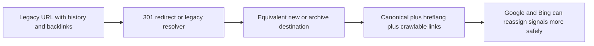
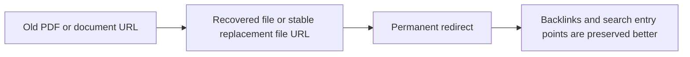
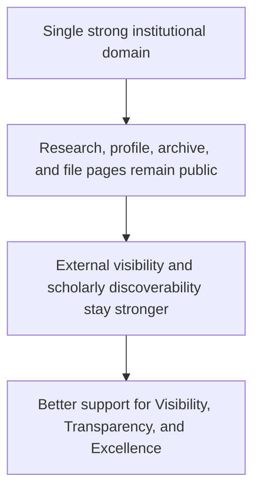

# Ranking Protection Visual Guide

## How Signal Protection Works

## How File Protection Works

## How Webometrics Protection Works

## The Main Message

Rankings do not survive a migration because the new site is attractive.

They survive more safely when the university protects the signals that already exist.
