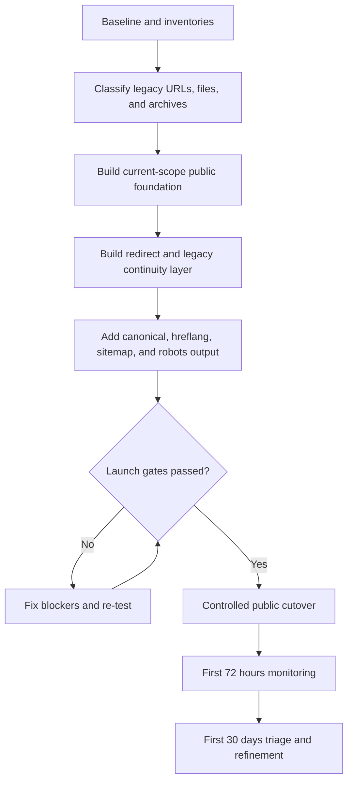
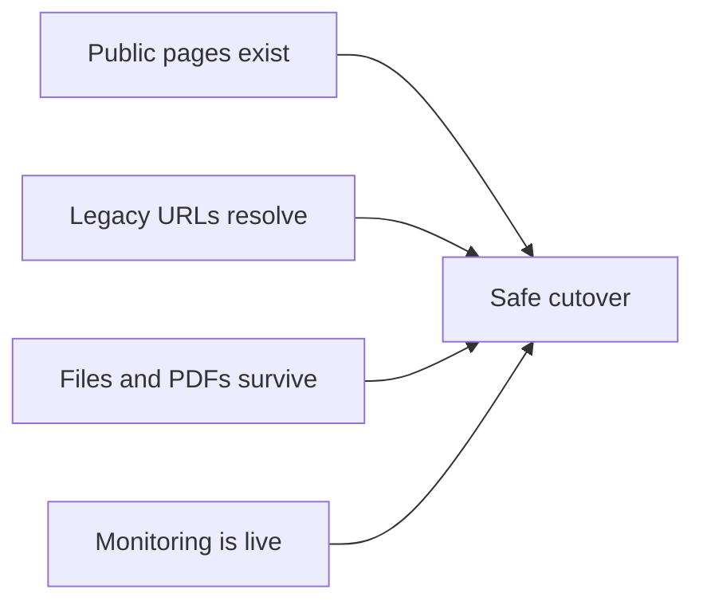
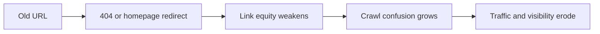
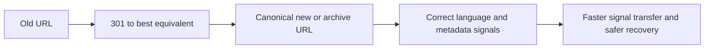

# Visual Roadmap

## Migration Sequence

## What Must Happen Before Launch

## What A Bad Migration Looks Like

## What A Professional Migration Looks Like

## Release Mindset

The visual summary is simple:

- inventory first
- continuity second
- launch last

Not the other way around.
